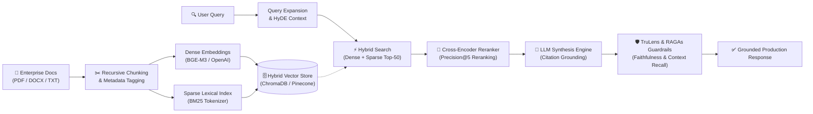

### 🚀 `< Senior Full Stack & AI Systems Engineer | Enterprise RAG | Scalable APIs />`

💼 **Open to Work & Technical Advisory** &nbsp;|&nbsp; ⚡ **Architecting high-performance intelligent systems**

 

 

---

## 👨‍💻 About Me

Senior Full-Stack & AI Systems Engineer specializing in end-to-end Enterprise RAG pipelines, autonomous agentic workflows, and high-throughput production web services. I bridge the gap between model research and scalable product engineering—designing resilient data pipelines, optimizing retrieval latency, enforcing evaluation guardrails, and building responsive user interfaces.

  
<b>Open Senior Engineering Brief</b>

   

  | Dimension | Detail |
  | :--- | :--- |
  | **Role** | Senior Full Stack & AI Systems Engineer |
  | **Core Languages** | Python · TypeScript · JavaScript · SQL · PHP |
  | **Primary Focus** | Enterprise RAG · Agentic State Machines · Vector Indexing · Scalable Distributed APIs |
  | **Engineering Core** | Latency Optimization · Grounded Retrieval · Measurable ROI · Zero-Trust Guardrails |
  | **Status** | Open to high-impact engineering roles, consulting & collaborations |

  *Click a section above to jump. Click a card below to open the repository.*

---

## 🧠 Flagship AI Architecture: Production RAG Pipeline

Below is the production retrieval and evaluation topology engineered for **[Enterprise_Documents](https://github.com/armishiqbal/Enterprise_Documents)**, demonstrating hybrid dense-sparse vector search, cross-encoder re-ranking, and automated evaluation guardrails:

---

## ⚡ Production Systems & Engineering Benchmarks

A quantitative overview of production architectures, engineering benchmarks, and live deployments:

| Project & Architecture | Core Engineering Highlights | Benchmarks & Metrics | Live Links |
| :--- | :--- | :--- | :---: |
| **[Enterprise Documents AI](https://github.com/armishiqbal/Enterprise_Documents)** *Hybrid RAG · Cross-Encoder Reranker · Vector Ops* | Multi-tenant document indexing, semantic chunking, grounded citations | **$< 300\text{ ms}$** p95 latency **$92\%$** answer faithfulness (RAGAs) **$40\%$** token caching savings | [Live Demo ↗](https://enterprisedocuments-mykuyzjycbucehracp2jfv.streamlit.app) · [Code ↗](https://github.com/armishiqbal/Enterprise_Documents) |
| **[EasyTune Music Player](https://github.com/armishiqbal/EasyTune-Music-App)** *React · Vite · Web Audio API · Client Cache* | Responsive music streaming app, custom buffer manager, playlist state sync | **$0\text{ ms}$** playback hitch Client-side chunk pre-fetching Mobile-first PWA architecture | [Source Code ↗](https://github.com/armishiqbal/EasyTune-Music-App) |
| **[Wooden Bed Booking Engine](https://github.com/armishiqbal/Wooden-Bed-Booking-System)** *Django · DRF · SQLite/PostgreSQL · Admin Panel* | Atomic database transactions, strict booking concurrency controls, REST APIs | **$100\%$** ACID compliance Zero double-booking race conditions Normalized relational schema | [Source Code ↗](https://github.com/armishiqbal/Wooden-Bed-Booking-System) |
| **[Hospital Management System](https://github.com/armishiqbal/Hospital-Management-System)** *PHP · MySQL · CRUD Engine · RBAC* | Role-Based Access Control, doctor-patient triage, prescription & lab records | Normalized relational database Authenticated session security Complete audit logging | [Source Code ↗](https://github.com/armishiqbal/Hospital-Management-System) |

 

  
  

  
  

  
  
  

---

## 🛠️ Specialized Technical Domains

  
<b>Core AI & Systems Engineering Disciplines</b>

   

  * **Retrieval & Vector Ops** — Hybrid Dense/Sparse Search (BGE-M3 + BM25) · HNSW Indexing · ColBERT & Cross-Encoder Reranking · Contextual Chunking · Dynamic Metadata Filtering
  * **LLM Orchestration & Agentic Systems** — Multi-Agent State Machines (LangGraph) · Tool Routing & Function Calling · Structured Outputs (Pydantic / Instructor) · Deterministic Fallbacks
  * **Evaluation & Observability** — RAGAs (Faithfulness, Answer Relevance, Context Precision) · TruLens Metrics · Langfuse Tracing · Latency vs. Cost Optimization
  * **Full-Stack & Cloud Infrastructure** — FastAPI Async Endpoints · Streamlit · React · TypeScript · Vite · Django & DRF · PostgreSQL · MySQL · Docker · Vercel · Linux

 

---

## 📊 Performance & Contribution Activity

  
  
   
  
   
  

---

## 🤝 Connect & Collaborate

Open to senior engineering roles, technical consulting, and collaborative RAG / AI product initiatives.

 

 

